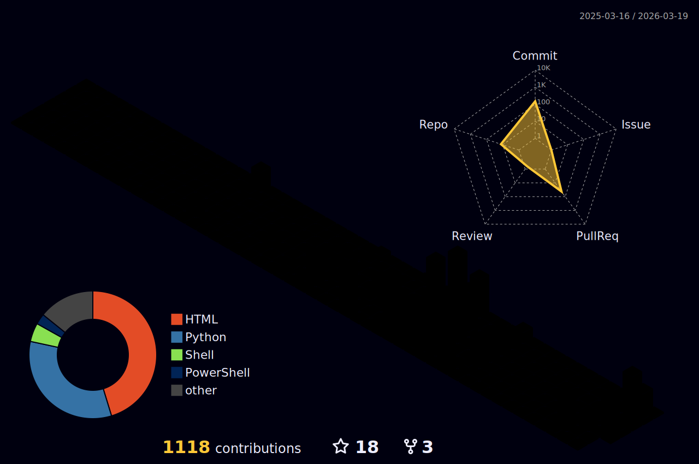

# 👋 Welcome to the Shadows 😼

<div align="center">
  
  
  
  [](https://shadowdevnotreal.github.io)
  [](https://github.com/shadowdevnotreal)
  
</div>

---

## 🌟 About Me

```python
class ShadowDev:
    def __init__(self):
        self.username = "shadowdevnotreal"
        self.name = "ShadowDev"
        self.role = "IT Consultant & Automation Engineer"
        self.experience = "25+ years in IT consulting"
        self.specialization = "Microsoft SME | FastTrack EM+S"
        self.location = "The Shadows 🌑"
        self.languages = ["Python", "JavaScript", "Bash", "PowerShell", "HTML/CSS"]
        self.expertise = [
            "Cloud Security", "Azure", "Microsoft 365", "Automation",
            "AI/ML Development", "Cybersecurity", "Compliance"
        ]
        self.current_focus = [
            "AI-Powered Tools", "Security Automation", 
            "Cloud Infrastructure", "Pentesting"
        ]
        self.certifications = [
            "Microsoft SME", "CompTIA A+", "Sophos Engineer",
            "Fortinet NSE 2", "Six Sigma", "Social Engineering"
        ]
        self.fun_fact = "I debug code in my sleep and automate everything 😴"
    
    def say_hi(self):
        print("Thanks for dropping by! Let's automate something awesome together 🚀")
        
me = ShadowDev()
me.say_hi()
```

---

## 🛠️ Professional Arsenal

<div align="center">

### Core Technologies


### Cloud & Enterprise


### Security & Networking


### Development & Tools


</div>

---

## 🎯 Current Projects & Focus

- 🤖 **AI-Powered Automation**: Developing intelligent tools for IT workflows and security analysis
- 🛡️ **Security Toolkits**: Building comprehensive penetration testing and vulnerability assessment suites
- ☁️ **Cloud Infrastructure**: Microsoft 365 compliance, Azure security, and hybrid cloud solutions
- 🔧 **Enterprise Automation**: PowerShell and Python scripts for system administration and monitoring
- 📊 **OSINT & Reconnaissance**: Tools for security assessment and attack surface analysis
- 🎓 **AI Training Models**: Custom GPTs for specialized cybersecurity and IT consulting tasks

---

## 📊 GitHub Analytics

<div align="center">


</div>

<div align="center">

  
  

</div>

<div align="center">

  

</div>

<div align="center">

  

</div>

<div align="center">

  

</div>

---

<div align="center">

## 🏆 Featured Projects

<table>
<tr>
<td width="50%">

### 🛡️ [Universal Testing Engine](https://github.com/shadowdevnotreal/Universal-Testing-Engine)
Advanced Adaptive Assessment Platform with Integrated IT Professional Assessment


</td>
<td width="50%">

### 🔧 [CyberSec ToolKit](https://github.com/shadowdevnotreal/CyberSecToolKit)  
Comprehensive cybersecurity utilities and scripts for ethical hacking


</td>
</tr>
<tr>
<td width="50%">

### 🧑‍🎓 [BowTied-Cyber-AI-Ecosystem](https://github.com/shadowdevnotreal/BowTied-Cyber-AI-Ecosystem)
Architecting the Future of Cybersecurity Education


</td>
<td width="50%">

### ⚖️ [Ombudsman](https://github.com/shadowdevnotreal/ombudsman)
Organizational chart showing corporate ombudsman structure  


</td>
</tr>
</table>

</div>


---

### 🔍 Security & Analysis Tools
- **[CyberSecToolKit](https://github.com/shadowdevnotreal/CyberSecToolKit)** - Collection of cybersecurity utilities and scripts
- **[Recall Hard Off Helper](https://github.com/shadowdevnotreal/Recall-Hard-Off-Helper)** - Windows privacy and security automation

### 🤝 Open Source Contributions
- **[XSSRocket](https://github.com/shadowdevnotreal/XSSRocket)** - XSS vulnerability detection toolkit
- **[ScopeHunter](https://github.com/blackhatethicalhacking/ScopeHunter)** - Bug bounty scope analysis tool

### 📡 OSINT & Reconnaissance  
- **[WWWScope](https://github.com/shadowdevnotreal/WWWScope)** - Web application security analysis tool

---

## 🤖 AI Projects & Custom GPTs

### 🎨 Creative AI Tools
- **[Clan Render](https://chatgpt.com/g/g-68ac0cbf9a9c8191be631440c2a3cfe8-clan-render)** - Transforms portraits into hybrid animal-clan illustrations

### 🛡️ Security & Assessment
- **[Cyber Gauntlet Bot](https://chatgpt.com/g/g-681f26522b2081919a4e8750aaa11fb5-cyber-gauntlet-bot)** - Interactive cybersecurity challenge arena

### 📚 Educational & Consulting
- **[BowTiedCyber Bootcamp Guide](https://chatgpt.com/g/g-6833c1ec235881919ce84a0356c201f3-bowtiedcyber-bootcamp-guide)** - Cybersecurity education and training assistant

### 💙 Life and Mental Health
- **[Dr. HOPE - Whistleblower Counselor](https://chatgpt.com/g/g-6832658d75988191a6a6572573bf3122-dr-hope-whistleblower-assessment-counselor)** - Specialized psychological assessment for whistleblowing scenarios
- **[Custody Life Coach](https://chatgpt.com/g/g-686509eec914819181e27d26d6a35742-custody-life-coach)** - Legal and emotional guidance system
- **[REPAIR Protocol Support Bot](https://chatgpt.com/g/g-685f7ec1cae4819183b514fdeff27b43-repair-protocol-support-bot)** - Cognitive/emotional system mapping and support

---

## 💼 Professional Experience Highlights

- **25+ Years** in IT Consulting & Systems Administration
- **Microsoft Subject Matter Expert** (FastTrack EM+S | Compliance)
- **Enterprise Security Specialist** - Azure, M365, compliance frameworks
- **Remote Leadership** - Cross-functional team management and consulting
- **Automation Engineer** - Python, PowerShell, and AI-driven workflow optimization
- **Social Engineering Specialist** - Advanced OSINT and security assessment

### 🎓 Key Certifications
- Microsoft FastTrack EM+S Specialist
- CompTIA A+ Certified
- Sophos Certified Engineer  
- Fortinet NSE 2 Network Security Associate
- Advanced Practical Social Engineering
- Six Sigma White Belt
- Cradlepoint Certified Network Associate

---

## 🌐 Connect With Me

<div align="center">

[](https://shadowdevnotreal.github.io)
[](https://github.com/shadowdevnotreal)
[](mailto:43219706+shadowdevnotreal@users.noreply.github.com)

</div>

---

## 💭 Random Dev Quote

<div align="center">


</div>

---

## 📈 Contribution Activity

<div align="center">


</div>

---

<div align="center">
  
  ### 🎭 *"Automate the mundane, secure the critical, innovate the future"*
  
  
  
  ⭐️ From [ShadowDev](https://github.com/shadowdevnotreal) | Made with 💜, lots of ☕, and 25+ years of IT wisdom
  
</div>
